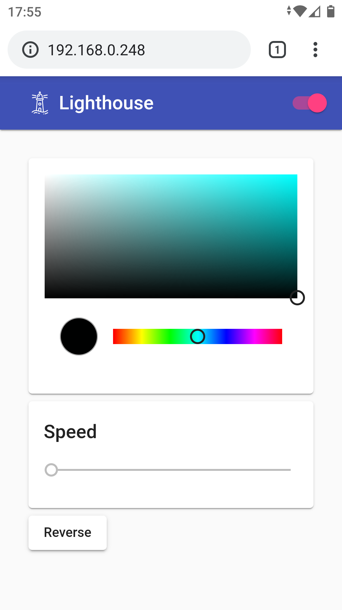

Material lighthouse controls
============================

This project contains the [Angular](https://angular.io/) and [Angular Material](https://material.angular.io/guide/getting-started) resources that accompany my [MicroPython lighthouse controls](https://github.com/george-hawkins/micropython-lighthouse-controls) project.

To serve and open in a new browser tab:

    $ ng serve --open

To build and commit to the `gh-pages` branch:

    $ source ./update-gh-pages.sh

I tried out various lighthouse icons. For more about this process, see [`lighthouses-icons/README.md`](lighthouses-icons/README.md).
